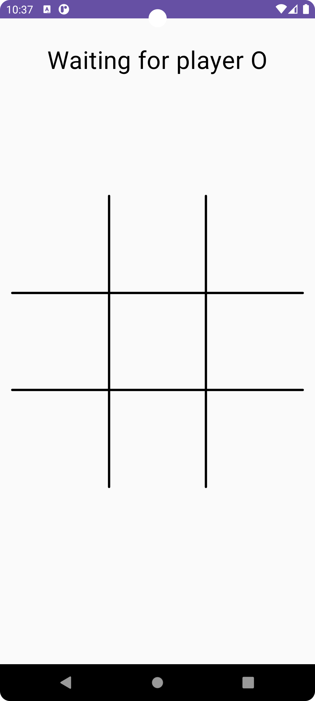
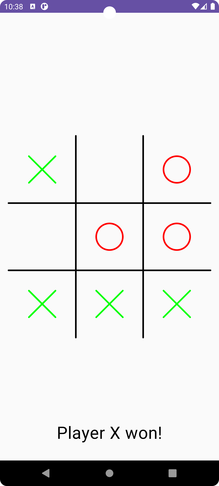

<h1 align="center">TicTacToe Game</h1>

Simple TicTacToe App 

## Tech Stacks

- <b>Ktor:</b> Building the backend and the Logic of the game  <"https://github.com/ahmedelshaikh20/TicTacToBackend"> 
- <b>Jetpack Compose:</b> Building Ui Fields and Instruction With Compose 
- <b>Hilt:</b> Used hilt for Dependency Injection
- <b>Canvas:</b>Used to draw simple custom views for Our App (X and O)

## Screenshots

|                   Waiting Screen                     |                   Player Won Screen                |                     
|:----------------------------------------------------:|:--------------------------------------------------:|
|                  |                         |
               
   
